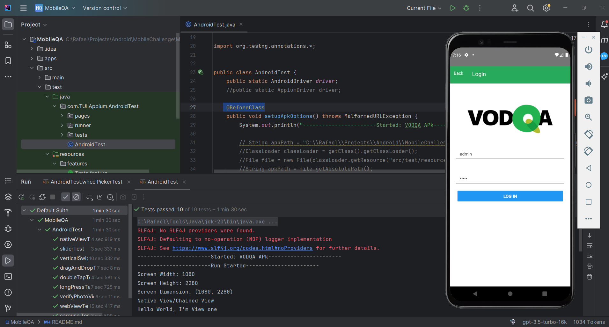

# Appium Java Test Project

This is a sample Appium Java project using JUnit and Cucumber for Android testing.

## Prerequisites

Make sure you have the following installed on your machine:

- Java Development Kit (JDK)
- Android Studio with SDK
- Appium
- Node.js
- Appium Server
- ChromeDriver (if you are testing on a physical Android device)

## Installation Steps

### 1. Install Java Development Kit (JDK)

Download and install the latest version of JDK from [Oracle's website](https://www.oracle.com/java/technologies/javase-downloads.html).

### 2. Install Android Studio

Download and install Android Studio from [here](https://developer.android.com/studio).

Ensure you set up the Android SDK in Android Studio.

### 3. Install Node.js

Download and install Node.js from [https://nodejs.org/](https://nodejs.org/).

### 4. Install Appium

Install Appium using npm (Node Package Manager) by running the following command:

> ```bash
>  npm install -g appium
> ```

### 5. Install Appium Server
Download and install the Appium Desktop application from Appium Releases.

### 6. Install ChromeDriver (for testing on a physical Android device)
If you are testing on a physical Android device, download ChromeDriver from https://sites.google.com/chromium.org/driver/.

### 7. Clone the Repository
Clone this repository to your local machine:
> ```bash
>  git clone git@github.com:rcardosopereira/vodqa.git
> ```

### 8. Configure Project
Open the project in your preferred IDE (IntelliJ IDEA, Eclipse, etc.) and configure the project settings.

### 9. Run the Project
##### Emulator
Start an Android emulator using Android Studio.
Run the Cucumber test using your IDE or the following command:
> ```bash
> mvn clean test -Dcucumber.options="--tags @emulator"
> ```

##### Physical Device
Connect your Android device to your machine.
Ensure USB debugging is enabled on your device.
Run the Cucumber test using your IDE or the following command:

> ```bash
>  mvn clean test -Dcucumber.options="--tags @device"
> ```

# Improvement notes
### Project in Constant Evolution
This project is a reflection of my constant desire to learn and improve. At every step, I am dedicating time and effort to improve my skills in the area of automated development and testing. Along this journey, I delved into a variety of online resources, explored courses on Udemy, and sought out valuable references in the vast area of Information Technology.
Each line of code represents a learning experience, a solution found and progress towards the completion of this project. I am grateful for each challenge encountered, as each one is an opportunity for growth.
This is more than a set of files; It is a representation of my commitment and passion for building efficient and well-structured solutions. Right now, the project is at a significant stage, but I recognize there is room for improvement.
In the next release, my focus will be on optimizing the Maven-related parts, implementing the Page Object Model (POM), improving the scenarios using Cucumber and, once everything is aligned, integrating with Docker to facilitate execution and environmental distribution.
I sincerely thank everyone who has followed this project so far. If you have any questions, suggestions or just want to exchange ideas, feel free to get in touch via my email: rcardosopereira@gmail.com

### Notes: 
Note that the AndroidTest.java file contains all the complete code, but without the POM structure.
In the Media folder, it contains an image of the manual test on a physical device and a video playing the automated test.

----
### License
This project is licensed under the MIT License - see the LICENSE file for details.

Note: Adjust the URLs, commands, and project-specific details as needed. This README assumes you are using Maven as a build tool (`mvn`). If you are using a different build tool, adjust the commands accordingly.
